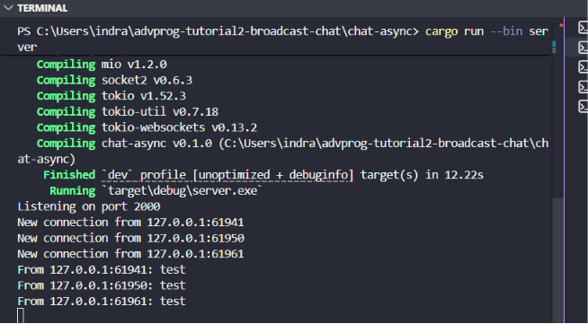
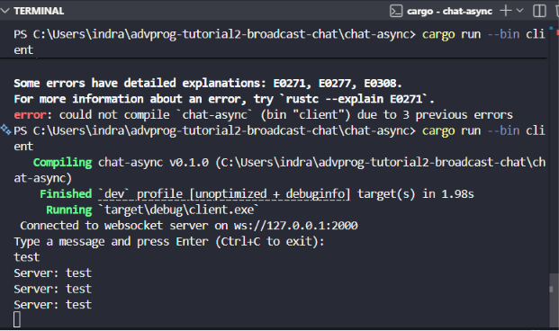
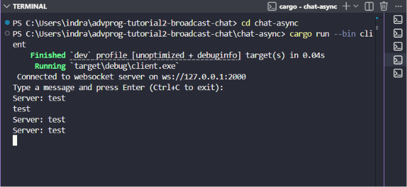
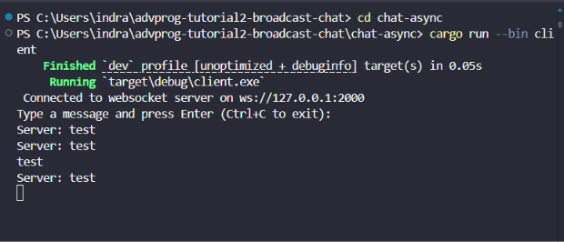
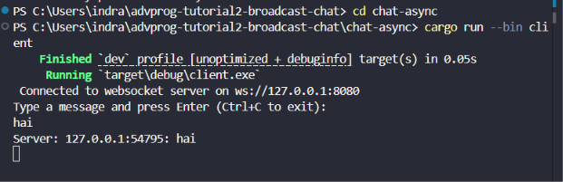
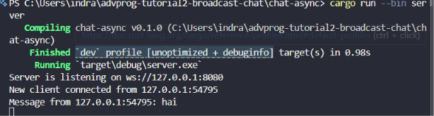

## Experiment 2.1: Original code, and how it run

### Description

In this experiment, I implemented the original broadcast chat application using asynchronous Rust. The application consists of one websocket server and multiple websocket clients. The server listens on `127.0.0.1:2000`, while every client connects to the same websocket address. When one client sends a message, the server receives that message and broadcasts it to all connected clients.

### How to run

Run the server first:

```bash
cargo run --bin server
```

Then run three clients in three different terminals:

```bash
cargo run --bin client
```

After that, type a message in one of the clients and press Enter.

### Result







### Explanation

The program uses asynchronous programming because the server needs to handle many clients at the same time without blocking the whole application. The server accepts websocket connections using `TcpListener`, then spawns a new asynchronous task for each connected client using `tokio::spawn`. Inside each connection handler, `tokio::select!` is used to wait for two possible events: a message from the current websocket client or a broadcast message from another client. This means the server can receive and send messages concurrently.

The broadcast mechanism uses `tokio::sync::broadcast`. When a client sends a message, the server forwards that message into the broadcast channel. Every active client connection has its own receiver from `bcast_tx.subscribe()`, so every client can receive the same message. This is why a message typed in one client appears in the other clients. This behavior shows why asynchronous programming is useful for chat applications, because the application needs to wait for network input from many sources at the same time.

## Experiment 2.2: Modifying port

### Description

In this experiment, I changed the websocket port from `2000` to `8080`. This change needs to be done on both the server side and the client side. The server must listen on the new port, and the client must connect to the same new port.

### Modified files

The server address was changed in `src/bin/server.rs`:

```rust
let listener = TcpListener::bind("127.0.0.1:8080").await?;
println!("Server is listening on ws://127.0.0.1:8080");
```

The client websocket URI was changed in `src/bin/client.rs`:

```rust
let uri = Uri::from_static("ws://127.0.0.1:8080");
```

### How to run

Run the server:

```bash
cargo run --bin server
```

Run the clients:

```bash
cargo run --bin client
```


### Explanation

The websocket connection has two important sides: the server side and the client side. The server side decides where the application listens by calling `TcpListener::bind("127.0.0.1:8080")`. The client side decides where to connect by using the URI `ws://127.0.0.1:8080`. If only the server is changed but the client still connects to port `2000`, the connection will fail because there is no server listening on that old port. If only the client is changed but the server still listens on port `2000`, the client will also fail because it tries to reach the wrong destination.

The protocol is still `ws`, which means websocket without TLS. The host is still `127.0.0.1`, which means the application runs locally on my own computer. The only modified part is the port number. After changing both files, the chat application still works properly because both sides now use the same websocket address.

---

## Experiment 2.3: Small changes, add IP and Port

### Description

In this experiment, I modified the server so that every broadcasted message contains information about the sender address. The sender address consists of the sender IP address and port number. This makes the chat output more informative because every client can see which socket address sent the message.

### Modified code

The original server only broadcasted the plain message text:

```rust
bcast_tx.send(text.to_string())?;
```

I changed it into this:

```rust
let formatted_message = format!("{addr}: {text}");
bcast_tx.send(formatted_message)?;
```

### How to run

Run the server:

```bash
cargo run --bin server
```

Run multiple clients:

```bash
cargo run --bin client
```

Type a message from one client and observe the output in the other clients.

### Result





### Explanation

The sender address is obtained from the `addr` variable. This variable comes from `listener.accept().await`, which returns both the socket and the address of the connected client. In the previous experiment, the server only broadcasted the message text, so the clients could not know which connection sent the message. In this experiment, I changed the message format before sending it to the broadcast channel. The server now combines the sender address and the original message using `format!("{addr}: {text}")`.

This change is implemented on the server side because the server is the central part of the broadcast system. Every message from every client must pass through the server before it is sent to other clients. By modifying the message on the server, all clients receive the same formatted message consistently. The IP address is usually `127.0.0.1` because the experiment runs locally, while the port number may be different for each client. This port number helps distinguish one client connection from another client connection.

---

## Bonus: Rust Websocket server for YewChat

### Description

For this bonus experiment, I modified the Tutorial 2 Rust websocket server so it can be used by the Tutorial 3 YewChat web client. The original Tutorial 2 server only treated every websocket text frame as a plain chat message. YewChat also sends websocket data as text frames, but the text content is serialized JSON. Because of that, the Rust server does not need a different websocket transport. It only needs to understand the JSON message format used by the web client.

### Modified server behavior

The server now understands two incoming YewChat message types:

```json
{"messageType":"register","data":"indra"}
```

```json
{"messageType":"message","data":"hello"}
```

When a client registers, the server stores the username for that websocket connection and broadcasts a user list update:

```json
{"messageType":"users","dataArray":["indra"]}
```

When a registered client sends a chat message, the server broadcasts a YewChat-compatible message event:

```json
{"messageType":"message","data":"{\"from\":\"indra\",\"message\":\"hello\",\"time\":1710000000000}"}
```

The important detail is that the outer websocket payload is still one text message. The server serializes and deserializes JSON using `serde` and `serde_json`, then sends the result through the same `tokio::sync::broadcast` channel that was already used in Tutorial 2.

The server still listens on `127.0.0.1:8080` by default, so it matches the YewChat websocket URL. For testing, the port can also be changed with the `PORT` environment variable.

### Explanation

I changed `src/bin/server.rs` by adding typed Rust structs for the JSON protocol. `ClientMessage` represents incoming messages from YewChat, while `ServerMessage` represents outgoing messages sent back to the browser. The server also keeps a shared `BTreeMap<SocketAddr, String>` protected by `tokio::sync::Mutex`. This map connects each websocket address to the username that was sent in the `register` message.

This change is successful because it preserves the websocket mechanism from Tutorial 2 but changes the message contract to match Tutorial 3. The YewChat client expects `messageType: "users"` to update the online user list, and `messageType: "message"` with a serialized `data` field to render chat messages. The Rust server now sends both of those formats. It also removes disconnected users from the map and broadcasts the updated user list, so the browser UI can stay synchronized.

I prefer the Rust version for the server because it gives stronger type checking around the protocol and fits well with asynchronous networking through Tokio. The JavaScript or TypeScript version is faster to write and easier to prototype, but the Rust version makes invalid message handling and shared state more explicit. For a learning prototype, JavaScript is simpler. For a more reliable websocket service, I prefer Rust.
